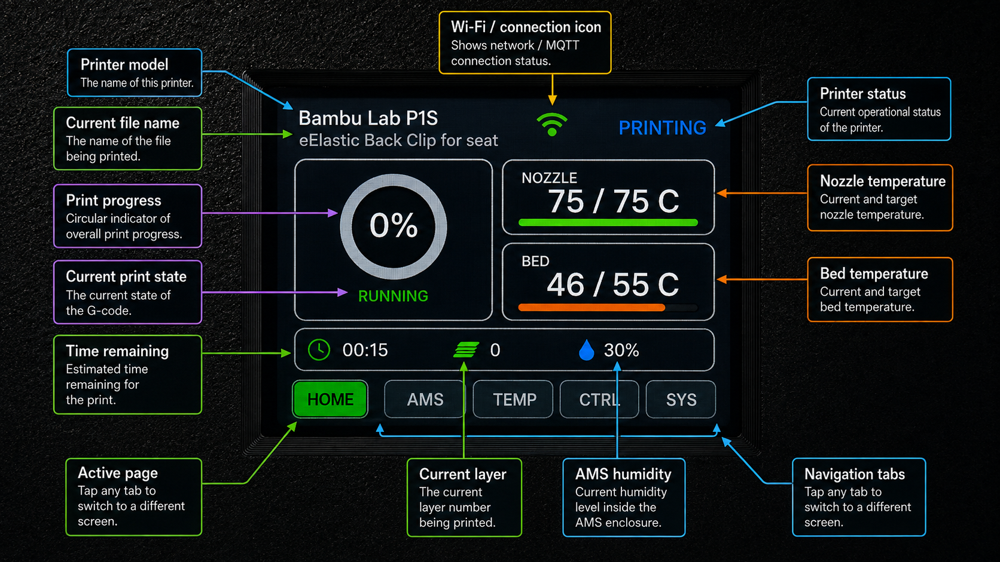
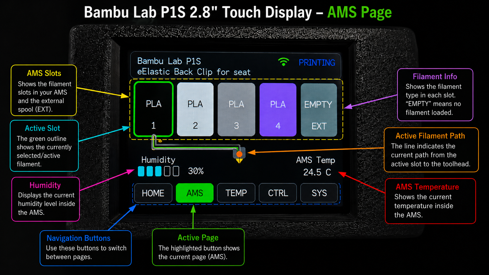
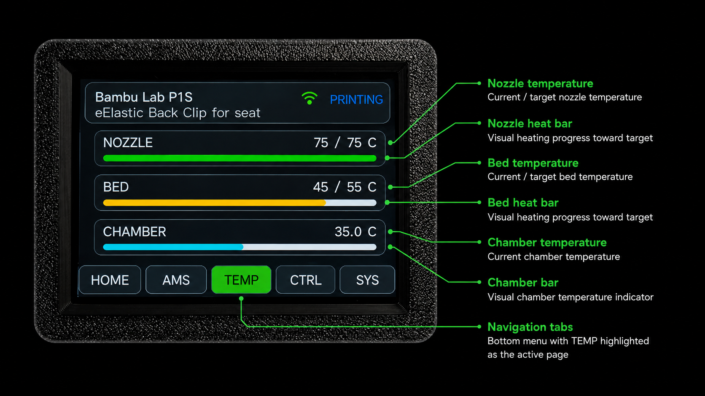
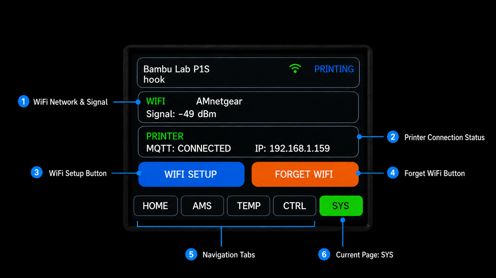
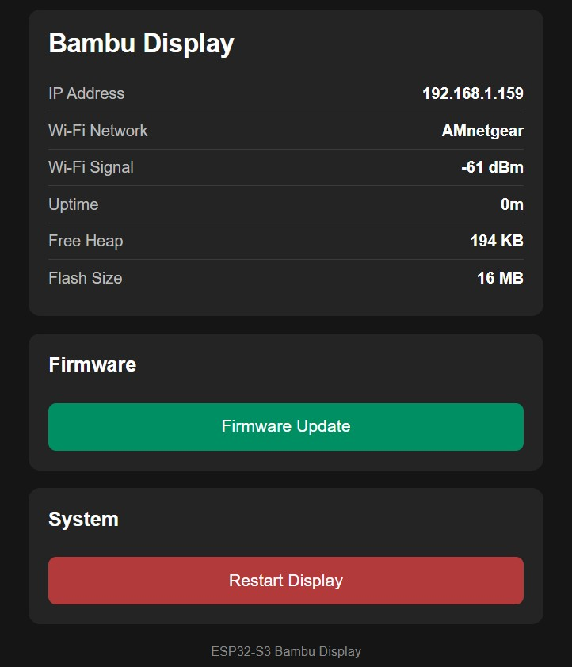

# Bambu Lab P1S Touchscreen Dashboard

A custom ESP32-S3 touchscreen dashboard for monitoring and controlling a Bambu Lab P1S printer over MQTT.

## Features

- Capacitive Touch Display
- Live print progress
- Printer status and current file
- Nozzle, bed, and chamber temperatures
- AMS slot colors and filament types
- Active filament path
- External spool status
- Pause and resume controls
- Chamber light control
- Automatic screen sleep and wake
- Web-based configuration
- Arduino OTA firmware updates
- Flip up display enclosure that retains use of original screen

## Screenshots

## Web Admin Page

## Flip Up Case

## Installation

See the complete [ESPHome Web installation instructions](INSTALLATION.md).

## Required Hardware

- [Freenove Capacitive Touch ESP32-S3 Display](https://www.amazon.com/dp/B0FSQF6FKN?th=1) *** Only tested with this display ***
- USB data cable
- Bambu Lab P1S printer
- Local network connection

## Important

This is an independent community project and is not affiliated with Bambu Lab.

## License

Copyright © 2026 Alan [Last Name].

The source code and compiled firmware in this repository are licensed
under the PolyForm Noncommercial License 1.0.0.

Personal, hobby, educational, and other noncommercial use is permitted.

Commercial use is not permitted without prior written permission from
the copyright holder. This includes selling displays containing this
firmware, selling modified versions, charging for copies, or including
the software in a paid product.

Commercial licensing inquiries: your-email@example.com

Third-party libraries and components remain subject to their respective
licenses.
